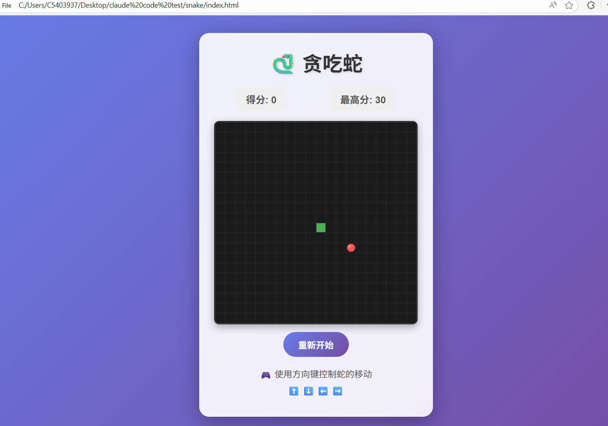

# 🐍 贪吃蛇游戏

一个使用纯 HTML、CSS 和 JavaScript 开发的经典贪吃蛇游戏。

## 📸 游戏截图

<div align="center">

### 游戏开始


### 游戏进行中


### 游戏结束


</div>

## ✨ 特性

- 🎮 使用方向键控制蛇的移动
- 📊 实时显示当前得分
- 🏆 自动保存最高分（使用 localStorage）
- 👀 蛇头有眼睛，会根据移动方向改变
- 🍎 精美的食物和蛇身渐变效果
- 🎯 碰到墙壁或自己的身体游戏结束
- 🔄 支持重新开始游戏
- 💅 精美的渐变色界面设计

## 🚀 快速开始

### 在线游玩

直接访问 [在线演示](https://better-yan.github.io/snake-game/) 开始游戏！

### 本地运行

1. 克隆仓库：
```bash
git clone https://github.com/better-yan/snake-game.git
```

2. 进入项目目录：
```bash
cd snake-game/snake
```

3. 在浏览器中打开 `index.html` 文件即可开始游戏

或者使用本地服务器：
```bash
# 使用 Python
python -m http.server 8000

# 或使用 Node.js (需要先安装 http-server)
npx http-server
```

然后在浏览器中访问 `http://localhost:8000`

## 🎮 游戏操作

- **⬆️ 上箭头** - 向上移动
- **⬇️ 下箭头** - 向下移动
- **⬅️ 左箭头** - 向左移动
- **➡️ 右箭头** - 向右移动

## 📁 项目结构

```
snake/
├── index.html      # HTML 结构
├── style.css       # 样式文件
└── game.js         # 游戏逻辑
```

## 🛠️ 技术栈

- **HTML5** - 页面结构和 Canvas 绘图
- **CSS3** - 样式和动画效果
- **JavaScript (ES6)** - 游戏逻辑实现

## 📝 游戏规则

1. 使用方向键控制蛇的移动方向
2. 吃到红色食物得 10 分，蛇身变长
3. 撞到墙壁或自己的身体游戏结束
4. 尽可能获得更高的分数！

## ⚙️ 游戏配置

游戏的速度和网格大小可以在 `game.js` 中修改：

```javascript
// 游戏配置
const gridSize = 20;           // 网格大小（像素）
const tileCount = 20;          // 网格数量
const gameSpeed = 1000;        // 游戏速度（毫秒）
```

## 🎯 未来计划

- [ ] 添加难度选择（简单/中等/困难）
- [ ] 添加音效和背景音乐
- [ ] 添加移动端触摸控制支持
- [ ] 添加暂停功能
- [ ] 添加排行榜
- [ ] 添加不同的游戏模式

## 📄 许可证

MIT License

## 👨‍💻 作者

better-yan

## 🤝 贡献

欢迎提交 Issue 和 Pull Request！

1. Fork 本仓库
2. 创建你的特性分支 (`git checkout -b feature/AmazingFeature`)
3. 提交你的更改 (`git commit -m 'Add some AmazingFeature'`)
4. 推送到分支 (`git push origin feature/AmazingFeature`)
5. 打开一个 Pull Request

## 🙏 致谢

感谢所有为这个项目做出贡献的开发者！

---

⭐ 如果你喜欢这个项目，请给它一个星标！
